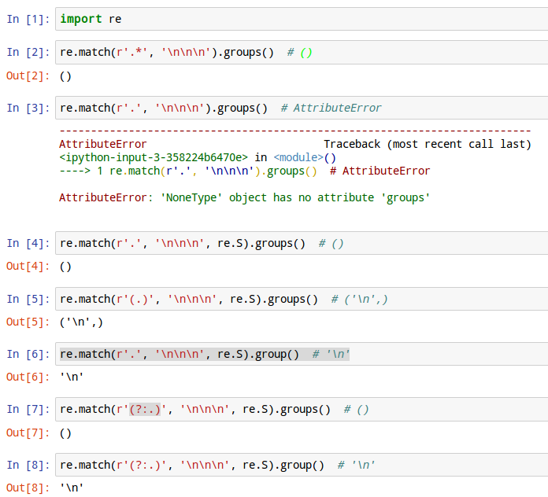
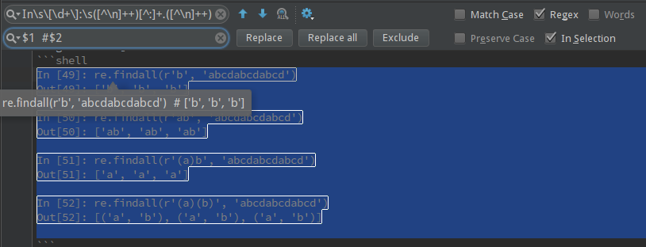

name: inverse
layout: true
class: center, middle, inverse
---
# Regular Expression - regex
author: [gshmu](http://gshmu.tk)

star: [github](https://github.com/gshmu/regex_slide)
.footnote[Welcome to the world of regex!]
---
## What is it and why should I be using it?
---
layout: false
.left-column[
  ## What is it?
]
.right-column[
  正则表达式是用单个字符串来描述、匹配一系列或某个句法规则的字符串。
### 查找符合某些复杂规则的字符串

- 找出所有的color 及 colour

- 找 "port" 与 "ports", 但又不希望找到 "export", "portable", "important" 等

- 找出ipv4地址

- 找出所有的空白行

正则表达式就是用于描述这些规则的工具。换句话说，正则表达式就是记录**文本规则**的代码。
]
.footnote[.red[*] 牢记：文本和特征]
---
template: inverse
## 正则是一门语言
  元字符和转义规则是所有语言的基石
.footnote[ 从编辑器到命令行再到编程语言随处可见正则表达式 ]
---
.left-column[
  ## 元字符
]
.right-column[
| 元字符 | 意义 | 备注 |
| :-----: | ----- | :-----: |
| . | 任意字符 | 默认不匹配换行，可以修改 |
| \ | 转义符 | `\\`表示`\`，元字符本身需要用`\`转义 |
| ^$ | 首和尾 | 表示一个位置 |
| [] | 字符组 | `^`开始的字符组是排除字符组 |
| () | 捕获分组 | `?`开始的捕获分组有特殊功能 |
| \b | 单词分界符 | `\<`,`\>` |
| ｜ | 分支 | or |
| ? | 一次或没有 |  |
| * | 多次或没有 |  |
| + | 一次或多次 |  |
| {n} | 按次匹配 | `{n}`,`{m,n}`和 `{n,}` |
| \s | 空白 | `[ \f\n\r\t\v]` |
| \d | 数字 | `[0-9]` |
| \w | 下划线或单词字符 | `[A-Za-z0-9_]` |

另外还有表示八进制`\num`，十六进制`\xnum`，Unicode`\unum`，控制字符`\cchar`以及单个字节`\C`等元字符
]
.footnote[.red[*] `\S` is `not \s` and `\W` is `not \w` ...]
---
.left-column[
  ## 优先级
]
.right-column[
| 优先级 | 元字符 |
| :-----: | :----- |
| 最高 | \ |
| 高 | (), (?), [] |
| 中 | *, +, ?, {n}, {n,m}, {n,} |
| 低 | ^, $ |
| 最低 | ｜ 

注：这个是正则字符串中的优先级，`\.`被优先解析为`.`本身，和是否优先匹配毫无关系。
]
---
.left-column[
  ## 量词
]
.right-column[
| | min | max |
| :-------: | :-------: | :-------: |
| ? | 0 | 1 |
| * | 0 | - |
| + | 1 | - |
| {n} | n | n |
| {n,m} | n | m |
| {n,} | n | - |
]
---
.left-column[
  ## 轻松一刻
]
.right-column[
- `[.]` 和 `\.` 等价

- `[0-9]` 和 `\d` 等价，字符组内`-`是元字符，而`.`不是！

- `[^0-9]` 和 `[0-9^]` 含义大不相同。

- `[-]`, `[^]`, `[$]` 仅表示单个字符。

- `[[]`, `[]]`, `[\]` 这些都是无效的，非法的。

- `[\w\d]` 这样是支持的。

- `[\.]` 这个表示什么？ "."还是"`\.`"呢？
]
---
template: inverse

## 专项进阶 
---
name: how

.left-column[
  ### 捕获/匹配
]
.right-column[
由*和?限定的对象在“匹配成功”时可能并没有匹配任何字符。什么字符都不能匹配到，他们仍然会报告“匹配成功”。

eg:
```python
# show output as comment
import re
bool(re.match(r'.*', '\n\n\n'))  # True
re.match(r'.*', '\n\n\n').groups()  # ()
re.match(r'.', '\n\n\n').groups()  # AttributeError

re.match(r'.', '\n\n\n', re.S).groups()  # ()
re.match(r'(.)', '\n\n\n', re.S).groups()  # ('\n',)
re.match(r'.', '\n\n\n', re.S).group()  # '\n'

re.match(r'(?:.)', '\n\n\n', re.S).groups()  # ()
re.match(r'(?:.)', '\n\n\n', re.S).group()  # '\n'
```

- `.`不能匹配换行，但是这一特性是可以通过`re.S`修改

- `re.match`可以用来判断是否匹配成功

- `groups()`返回所有匹配到的分组的tuple

- `group()`返回匹配到的文本，`group(0)`返回所有文本，分组从1开始索引

]
---

---
.left-column[
  ### 分组
]
.right-column[
`(...)`表示一个分组，但在gerp和sed等也有写作`\(...\)`。

从左到右分组依次可以用\1,\2,...来反向引用，但也有用$1,$2,...表示的，如PyCharm和Perl。

eg:
```python
import re
# 反向引用示例
bool(re.match(r'(aa)\s\1', 'aa aa'))  # True
bool(re.match(r'(aa)\s\1', 'aa ab'))  # False

# 分组示例
re.match(r'(\S+)\s(\S+)', 'aa bb').groups()  # ('aa', 'bb')
re.match(r'(?:\S+)\s(?:\S+)', 'aa bb').groups()  # () 
re.match(r'(?:\S+)\s(?:\S+)', 'aa bb').group()  # 'aa bb'
```
分组默认是：捕获分组，另外还有：
- 非捕获分组
- 命名分组
- 固化分组

]
---
.left-column[
  ### 分组
]
.right-column[
命名分组——.red.bold[有别名的捕获分组！]  `(?P<name>...)`

```python
import re
p = pattern = re.compile(r'(?P<xx>\S+)\s(?P<yy>\S+)\s(\1)')
s = 'aa bb aa' # limit line length

re.match(p, s).groups()  # ('aa', 'bb', 'aa')
re.match(p, s).group(1)  # 'aa'
re.match(p, s).group('xx')  # 'aa'

re.match(p, s).groupdict()  # {'xx': 'aa', 'yy': 'bb'}
```
- 命名分组是捕获分组，可以直接反向引用

- 命名分组可以用别名来获取

- 可以获取所有命名分组的字典

Python 原生不支持固化分组，固化的分组作为一个整体不会发生改变，要么全部使用，要么全部弃用。
（固化分组使用不当会导致匹配失败）
]
---
.left-column[
  ### 位置
]
.right-column[
匹配一个位置，如“开头”、“结尾”这样的描述，在正则中也有这样的描述，这些是不“占用”字符的。
如：`^`,`$`,`\b` 开头结尾和单词边界。

还有这样的描述：
- 前面是一个数字，`(?<=...)`
- 前面不能是字母，`(?<!...)`
- 后面必须是控制字符，`(?=...)`
- 后面必须不是空白，`(?!...)`

这些都是描述一个位置，而没有内容。这个有个专用名词叫环视，前后&肯否共计四种。

.red.bold[*] 截止目前我们需要明确，开头、结尾、边界和环视这些是不“占用”字符的。

用python的re.match的group来说，是一个不包含任何文本的空字符串。

Python 和 Perl中，逆序环视只能匹配**.red.bold[固定长度]**的文本！ 
]
---
.left-column[
  ### 模式
]
.right-column[
```python
import re
re.match(r'(?i)(AA)\s(B*)', 'aa bb').groups()  # ('aa', 'bb')
re.match(r'(AA)(?i)\s(B*)', 'aa bb').groups()  # ('aa', 'bb')
re.match(r'(AA)\s(B*)', 'aa bb', re.I).groups()  # ('aa', 'bb')

re.match(r'(AA)\s(?:(?i)(B*))', 'aa bb').groups()  # ('aa', 'bb')

re.match(r'(?i)(AA)\s^(B*)', 'aa\nbb', re.M).groups()  # ('aa', 'bb')
re.match(r'(AA)\s^(B*)', 'aa\nbb', re.I|re.M).groups()  # ('aa', 'bb')
```
- Python中可用原生模式修饰符位置不重要

- Python中模式修饰符范围支持不佳

- 可以混用模式修饰符

- 多个模式修饰符的写法

| 字  符 | 简  写 | 全  称 | 描  述 |
| :-------: | :-------: | :-------: | :-------: |
| i | re.I | re.IGNORECASE | 忽略大小写 |
| m | re.M | re.MULTILINE | 增强行描点 |
| s | re.S | re.DOTALL | 点号通配 |
| x | re.X | re.VERBOSE | 忽略空白和注释 |
|  | re.L | re.LOCALE |  |
|  | re.U | re.UNICODE |  |
]
---
.left-column[
  ### 匹配优先
]
.right-column[
```python
import re
re.match('.*', 'aoe!').group()  # 'aoe!'
re.match('.*!', 'aoe!').group()  # 'aoe!'
re.match('.*aoe!', 'aoe!').group()  # 'aoe!'

re.match('(.*)', 'aoe!').groups()  # ('aoe!',)
re.match('(.*)!', 'aoe!').groups()  # ('aoe',)
re.match('(.*)aoe!', 'aoe!').groups()  # ('',)

re.match('.*?', 'aoe!').group()  # ''
re.match('.+?', 'aoe!').group()  # 'a'

re.match('.*+', 'aoe!').group()  # invalid
```
- “贪婪”占有更多的字符是一种本性，但这不是匹配优先

- 优先占更少的字符则为忽略优先

- 优先量词为`+`和`?`（可以加在所有表示数量的后面）

- Python不支持匹配优先量词（匹配优先也有固化的性质）

.footnote[.red[*] 最后看代码中间挨着那三行]
]
.left-column[
  ### 忽略优先
]
---
template: inverse

## 回溯和优化
---
.left-column[
  ### 引擎流派
]
.right-column[
不同工具的正则有所差异，但最大的不同是由于引擎造成的。表达式主导NFA和文本主导DFA。

Python属于perl风格，属于传统型NFA引擎，与此相对的有POSIX NFA和DFA等引擎。

NFA学名为“非确定型有穷自动机”，DFA学名为“确定型有穷自动机”

说些DFA的特点，然后今天就和DFA说拜拜了：
- 目标文本中的每个字符最多只会检查一遍

- DFA 匹配很迅速

- DFA 匹配很一致

- 谈论DFA很恼人

.red.bold[*] 忘了DFA这个恼人的家伙，下来我们从回溯（backtracking）开始学习NFA。
]
---
.left-column[
  ### 回溯
]
.right-column[
备用状态：面对选择时`re.match(r'ao.?e', 'aoe')`当`ao`匹配后，匹配`.`出现一个**选择**，默认是匹配优先的，
所以`.`先匹配到`e`，然后后面的`e`匹配失败。这时回到`.`匹配到备用状态...

稍加修改就不会发生回溯：`re.match(r'ao.??e', 'aoe')`，请注意`.??`，这里通过忽略优先避免了回溯。

```python
import re
re.match(r'ao(.?)e', 'aoee').group(1)  # 'e'

re.match(r'ao(.??)e', 'aoee').group(1)  # ''
re.match(r'ao(.??)e', 'aoee').group()  # 'aoe'

re.match(r'ao(.??)e$', 'aoee').group()  # 'aoee'

re.match(r'ao(.?)(.?)(.?)e', 'aoee').groups()
re.match(r'ao(.??)(.?)(.?)e', 'aoee').groups()
re.match(r'ao(.?)(.??)(.?)e', 'aoee').groups()
re.match(r'ao(.?)(.?)(.??)e', 'aoee').groups()

# 1 2 1 1
```
]
---
.left-column[
  ### 优化
]
.right-column[

- 避免重新编译，把`re.compile`放在循环外部

- 使用非捕获型括号，不需要的统一用非捕获

- 善用锚点符号

- 不滥用字符组，`\w`优于`[a-zA-Z0-9_]`优于`[abcdef...]`优于`(?:a|b|c|...)`

- 提取文本和锚点，`^(?:a|b)`优于`(?:^a|^b)`

- 量词代换，_Python中_`\d{4}`比`\d\d\d\d`快，但不全是

- 避免指数级

- 用`[^x]*`代替`.*`是个好主意

- 化简量词`.*`优于`(?:.)*`，`xx*`优于`x+`

- 将结尾部分分散到分支（有时有用，但不全是）

- `\.`优于`[.]`

]
---
.left-column[
  ### 实例
]
.right-column[
这是一个使用过的检查电话号码合法的正则。
```perl
^
(
  (
    (13[0-9])
    |
    (15
      ([0-3]|[5-9])
    )
    |
    (18[0,5-9])
  )
  \d{9}
)
|
 (0\d{2}-\d{8})
|
 (0\d{3}-\d{7})
$
```
]
.footnote[.red[*] 这个规则有点过时，比较新的[click here](https://github.com/VincentSit/ChinaMobilePhoneNumberRegex)]
---
.left-column[
  ### refine
]
.right-column[
```python
import re
re_str = r"""
^
(?:\+?86)?
(?:
  1(?=\d{10}$)
    (?:[38]|5[^4\D]|7[^249\D])\d+
  |
  0\d\d(?=[\d-]{9}$)
    (?:-\d|\d-)\d{7}
)
$
"""
pattern = re.compile(re_str, re.X)

pattern.match('138123456789').group()
```

哪里还能优化？  欢迎讨论
]
---
template: inverse

## Using regex with Python
---
.left-column[
  ### match
]
.right-column[
下面的眼熟吧，这就是之前的用正则串`\s+#[^#\n]+$`替换后的，大家还记得么？

```python 
import re
re.match(r'.*', '\n\n\n').groups()
re.match(r'.', '\n\n\n').groups()

re.match(r'.', '\n\n\n', re.S).groups()
re.match(r'(.)', '\n\n\n', re.S).groups()
re.match(r'.', '\n\n\n', re.S).group()

re.match(r'(?:.)', '\n\n\n', re.S).groups()
re.match(r'(?:.)', '\n\n\n', re.S).group()
```

经过刚才的接触，re.match的用法相信大家已经不陌生了：re.MatchObject

- 可以直接用if判断，是否匹配成功

- groups返回所有匹配到组的tuple

- group反回所有匹配到的文本

- group(1)返回第一个捕获分组匹配的文本

- groups()[0] == group(1)

]
---
.left-column[
  ### [match](https://docs.python.org/2/library/re.html#match-objects)
]
.right-column[
```python
import re
bool(re.match(r'a', 'aoe'))  # True
bool(re.match(r'o', 'aoe'))  # False

bool(re.compile(r'e$').match('aoe'))  # False
bool(re.compile(r'o').match('aoe', 1))  # True

re.compile(r'o').match('aoe', 1).span()  # (1, 2)
'aoe'[1:2]  # 'o'

re.search(r'o', 'aoe').span()  # (1, 2)
re.search(r'o', 'aoeoe').span()  # (1, 2)
```

- match默认带着`^`，需要从开头匹配，可以改变开始位置

- 检查用户输入时可以用match，有时候你需要的是search

re.match大家应该都会用了，更多请参见[官方文档](https://docs.python.org/2/library/re.html)。

]
---
.left-column[
  ### findall
]
.right-column[
```python
import re
re.findall(r'b', 'abcdabcdabcd')  # ['b', 'b', 'b']

re.findall(r'ab', 'abcdabcdabcd')  # ['ab', 'ab', 'ab']

re.findall(r'(a)b', 'abcdabcdabcd')  # ['a', 'a', 'a']

re.findall(r'(a)(b)', 'abcdabcdabcd')  # [('a', 'b'), ('a', 'b'), ('a', 'b')]
```
findall就说这么多吧，文档是最好的...

Python不支持固化，也不支持匹配优先：
```python
import re
re.match(r'^(?=(\w+))\1', 'aoe').group()  # 'aoe'

re.match(r'^(\w+).', 'aoe').group(1)  # 'ao'

bool(re.match(r'^(?=(\w+))\1.', 'aoe'))  # False
```

这份课件的所有代码都执行过，有些相似的是我构造的，里面微小的差异，大家可以自己再品评下。

]
---


- `^[^:]++.\s([^\n]++)\n[^:]++.([^\n]++)`

- 查找替换的精髓是：捕获分组与反向引用

- 非捕获分组不仅可以节省内存开支，还帮助获得清晰的捕获分组

- 请大家注意不捕获，零宽字符

- 一个位置可以被多个零宽同时匹配（零宽度是非互斥的）

- 表达式本身是贪婪的，但捕获优先是固化的
---
name: last-page
template: inverse

## Thanks

.footnote[Slideshow created using [remark](http://github.com/gnab/remark), writer with [Markdown](http://daringfireball.net/projects/markdown/).]
